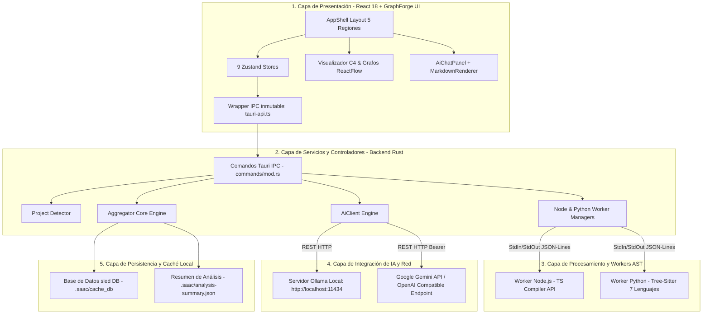
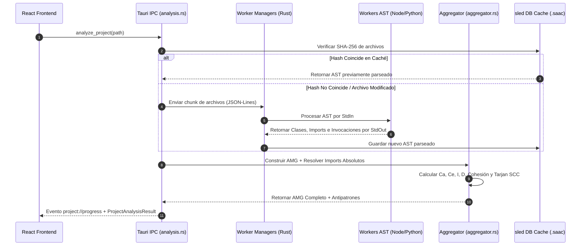
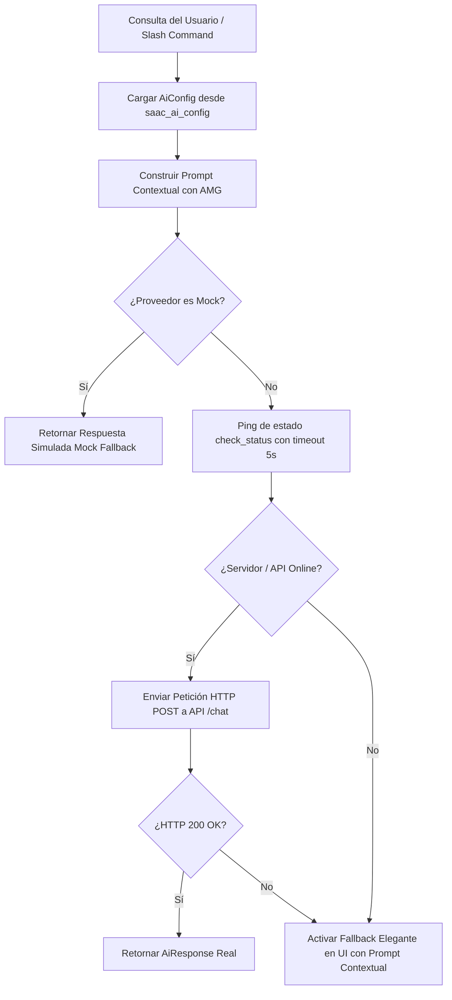

# CAPÍTULO 4: INGENIERÍA DEL PROYECTO

En este capítulo se detalla la especificación técnica, el diseño de arquitectura de software, la implementación de componentes y el conjunto de pruebas que constituyen el sistema **SAAC v2.0** (*Software Architecture Analysis Companion*). Toda la descripción técnica aquí expuesta se encuentra estrictamente respaldada y verificada contra el código fuente del repositorio del proyecto.

---

## 4.1 Análisis de Requisitos

El desarrollo de SAAC v2.0 se fundamenta en un conjunto de requisitos funcionales (RF) y no funcionales (RNF) orientados a garantizar el análisis estático multilinguaje, el cálculo riguroso de métricas de software, la detección de antipatrones, la generación automática de diagramas C4 y el soporte de inteligencia artificial contextual.

### Requisitos Funcionales (RF)

* **RF-01: Escaneo y Parseo Multilinguaje de Código Fuente.** El sistema debe analizar proyectos de software escritos en 8 lenguajes (*TypeScript, JavaScript, Python, Java, Kotlin, C#, Swift y Go*), extrayendo árboles de sintaxis abstracta (AST), clases, interfaces, métodos y la totalidad de llamadas e invocaciones función-a-función.
* **RF-02: Generación del Grafo del Modelo de Arquitectura (AMG).** El motor backend debe consolidar la información del proyecto en un modelo unificado (*Architecture Model Graph*), resolviendo dependencias absolutas, paquetes e imports en proyectos de estructura compleja (*Java Maven/Gradle, Go Modules, Rust Crates*).
* **RF-03: Cálculo de Métricas y Detección de Antipatrones.** El sistema debe calcular el Acoplamiento Aferente ($Ca$), Acoplamiento Eferente ($Ce$), Instabilidad ($I$), Cohesión de Módulo y la Distancia a la Secuencia Principal ($D$), identificando automáticamente antipatrones arquitectónicos como *God Module*, *Circular Dependency* y *Layer Violation*.
* **RF-04: Visualización Interactiva C4 y Diagramas Suplementarios.** La interfaz debe renderizar diagramas C4 (Niveles 1, 2, 3 y Nivel 4 UML bajo demanda), así como diagramas suplementarios (*Force Graph, Package Diagram, Inheritance Tree, ER Diagram, Call Graph, Sequence Diagram, Dynamic Diagram y DFD*).
* **RF-05: Asistente de Inteligencia Artificial Contextual.** El sistema debe proveer un chat interactivo capaz de inyectar el contexto real del AMG en las consultas a modelos de lenguaje (LLM), soportando explicaciones de código y refactorizaciones recomendadas mediante comandos *slash* (`/explain`, `/refactor`).

### Requisitos No Funcionales (RNF)

* **RNF-01: Rendimiento y Análisis Incremental.** El tiempo de re-análisis de proyectos modificados debe optimizarse mediante almacenamiento en caché persistente en disco (base de datos `sled`), evitando re-parsear archivos cuyo hash SHA-256 no haya cambiado.
* **RNF-02: Independencia y Privacidad de Proveedores de IA.** El módulo de Inteligencia Artificial debe ser agnóstico del proveedor de LLM, permitiendo ejecución 100% offline local (*Ollama*), proveedores Cloud compatibles con la especificación REST de OpenAI (*Google Gemini API*, OpenAI, Groq) o un modo simulado (*Mock Fallback*) en caso de desconexión.

---

## 4.2 Diseño de Arquitectura del Sistema

### 4.2.1 Selección de Tecnologías, Modelos y Librerías

La selección tecnológica de SAAC v2.0 combina un backend de alto rendimiento en Rust con un frontend dinámico en React 18 y procesadores de sintaxis independientes. La Tabla 4.1 resume la evaluación tecnológica del sistema.

***Tabla 4.1. Selección Tecnológica del Sistema SAAC v2.0.***

| Componente | Tecnología Seleccionada | Justificación Técnica |
| :--- | :--- | :--- |
| **Framework App Desktop** | **Tauri v2 (Rust + Webview2)** | Consumo de memoria $<50 \text{ MB}$, binario nativo ligero y comunicación IPC segura. |
| **Backend Core & Engine** | **Rust 2021 Edition** | Garantía de concurrencia segura sin recolector de basura, procesamiento en paralelo y tipado estricto. |
| **Parsing AST Principal** | **Tree-Sitter (Python Worker)** | Parseo incremental tolerante a errores sintácticos para Java, Kotlin, C#, Swift, Go, Rust y Python. |
| **Parsing AST JS/TS** | **TypeScript Compiler API (Node Worker)** | Parseo oficial y exactitud del 100% en tipos, decorators e invocaciones TypeScript/JavaScript. |
| **Base de Datos de Caché** | **sled DB (Rust Embedded)** | Almacenamiento clave-valor de alto rendimiento embedido sin dependencias de servicios externos. |
| **Lienzo de Diagramas** | **ReactFlow v11 + Dagre Layout** | Renderizado reactivo de grafos con ordenamiento automático por niveles de jerarquía. |
| **Gestión de Estado UI** | **Zustand v4** | Gestión de estado global simplificada con subscripciones atómicas y cero *boilerplate*. |

---

### 4.2.2 Arquitectura General del Sistema en 5 Capas

SAAC v2.0 adopta una arquitectura en 5 capas desacopladas, donde el **Architecture Model Graph (AMG)** actúa como la fuente única de verdad para el análisis, la visualización y las recomendaciones de IA.

***Figura 4.1. Diagrama de Arquitectura del Sistema SAAC v2.0 en 5 Capas.*** *Fuente: Elaboración propia.*



---

## 4.3 Backend Core y Capa de Análisis AST (Rust & Workers)

### 4.3.1 Configuración del Backend e Inicialización de Workers

El núcleo del sistema en Rust (`src-tauri/src/lib.rs`) gestiona el ciclo de vida de los analizadores sintácticos independientes. Los procesos externos Node.js (`workers/node/dist/index.js`) y Python (`workers/python/main.py`) son iniciados y gestionados mediante `NodeWorkerManager` (`workers/node_worker.rs`) y `PythonWorkerManager` (`workers/python_worker.rs`), utilizando rutas absolutas resueltas a través de `CARGO_MANIFEST_DIR`.

---

### 4.3.2 Parsers AST Multilinguaje y Pipeline de Análisis

La comunicación entre el backend Rust y los workers se realiza mediante el protocolo estandarizado de líneas JSON (*JSON-Lines*) sobre la entrada y salida estándar (`StdIn`/`StdOut`). 

***Figura 4.2. Diagrama de Secuencia del Pipeline de Análisis Estático.*** *Fuente: Elaboración propia.*



---

### 4.3.3 Extracción de Dependencias, Métricas y Antipatrones

El módulo `src-tauri/src/engine/aggregator.rs` es el responsable de consolidar las métricas de software. El cálculo de acoplamiento e instabilidad sigue las formulaciones teóricas de Robert C. Martin:

$$I = \frac{Ce}{Ca + Ce}$$

$$D = |A + I - 1|$$

A continuación se presenta el extracto literal de implementación en Rust correspondiente al cálculo de acoplamiento e instabilidad extraído de `aggregator.rs`:

```rust
// Fragmento extraído literalmente de src-tauri/src/engine/aggregator.rs
let ca = metrics.ca as f64;
let ce = metrics.ce as f64;
let total_coupling = ca + ce;

let instability = if total_coupling > 0.0 {
    ce / total_coupling
} else {
    0.0
};

let distance = (abstractness + instability - 1.0).abs();
metrics.instability = instability;
metrics.distance_from_main_sequence = distance;
```

Para la detección de dependencias circulares, `aggregator.rs` ejecuta el algoritmo de Componentes Fuertemente Conexas (SCC) de Tarjan, acompañado de un recorrido en profundidad (DFS) para extraer la ruta circular exacta (`cycle_path`).

---

### 4.3.4 Trazabilidad, Motor de Reglas y Persistencia del Resumen

La persistencia local del proyecto se organiza en la carpeta `.saac/`:
* `cache_db/`: Base de datos de caché empotrada en `sled`.
* `rules.json`: Configuración del evaluador de reglas y cálculo del *Fitness Score* ($0-100$).
* `history.json`: Snapshots inmutables de ejecuciones para el cálculo de deltas (`AMGDelta`).
* `annotations.json`: Persistencia de anotaciones, ADRs y antipatrones ignorados.
* `analysis-summary.json`: Archivo comprimido JSON generado automáticamente al finalizar cada escaneo por la función backend `save_analysis_summary` y replicado en el cliente vía `localStorage` bajo la clave `saac_last_analysis_summary`.

---

## 4.4 Diseño UI/UX en React — Sistema de Diseño GraphForge UI

### 4.4.1 Especificación del Layout de 5 Regiones y Tokens Visuales

El frontend de SAAC v2.0 ha sido desarrollado bajo la especificación **GraphForge UI** (`GraphForge — Design System & UI Specification.md`), caracterizado por una estética profesional *Near-Black* y tipografías técnicas.

***Figura 4.3. Esquema de Disposición del Layout GraphForge UI en 5 Regiones.*** *Fuente: Elaboración propia.*

```text
+---------------------------------------------------------------------------------------+
|  TopBar (48px) — Nombre del Proyecto | SAAC v2.0 | Menús IDE | Botón Cancelar         |
+----+------------------------------------+---------------------------------------------+
|    |  Explorer Panel (218px)            |  Canvas / Workspace Principal               |
| A  |  - Árbol de archivos               |  - Visualizador C4 ReactFlow                |
| c  |  - Jerarquía C4                    |  - Grafos Suplementarios / ForceGraph       |
| t  |  - Filtros y Búsqueda              |  - Paneles de Métricas y Antipatrones       |
| i  |                                    |                                             |
| v  |                                    |                                             |
| i  +------------------------------------+---------------------------------------------+
| t  |  Inspector Panel (275px)                                                         |
| y  |  - Vista de 2 Columnas de Propiedades (Nombre, Ruta, Lenguaje, LOC)             |
|    |  - Tarjetas Compactas 2x2 de Métricas (Ca, Ce, I, D, Mantenibilidad)            |
| B  |  - Lista de Conexiones de Entrada / Salida (Ca / Ce Connections)                |
| a  +----------------------------------------------------------------------------------+
| r  |  Downbar (166px) — Pestañas Técnicas: TERMINAL | PROBLEMAS | OUTPUT | HISTORIAL    |
|(46)|  Console log en fuente monoespaciada en fondo #0B0D10                            |
+----+----------------------------------------------------------------------------------+
|  StatusBar (23px) — ● Listo | Nodos: N | Aristas: E | Zoom: 100% | UTF-8 | SAAC v2.0    |
+---------------------------------------------------------------------------------------+
```

#### Tokens de Color Hexadecimales de GraphForge UI

Extraídos directamente de los tokens de variables CSS en `src/index.css`:
* **Fondo Principal Workspace (`--bg`)**: `#0B0D10`
* **Fondo de Paneles (`--panel`)**: `#101318`
* **Fondo de Tarjetas (`--panel-2`)**: `#13171D`
* **Borde Estándar (`--border`)**: `#252B34`
* **Borde Suave (`--border-soft`)**: `#1D222A`
* **Texto Primario (`--text`)**: `#E6E9ED`
* **Texto Atenuado (`--text-muted`)**: `#858C98`
* **Acento Púrpura UI (`--purple`)**: `#8B7CFF`
* **Cian de Datos (`--cyan`)**: `#45C8DF`
* **Verde de Salud Arquitectónica (`--green`)**: `#4FD49A`
* **Rojo de Alertas / Antipatrones (`--red`)**: `#EF6B73`
* **Amarillo de Advertencias / Bus Factor (`--yellow`)**: `#E7B85B`

#### Tipografía
* **Interfaz de Usuario**: `Inter`, sans-serif.
* **Datos de Código / Métricas / Consola**: `JetBrains Mono`, monospace.

#### Dimensiones Exactas del Layout en Píxeles
* **TopBar**: Altura fija de **48px**.
* **ActivityBar**: Ancho fijo de **46px**.
* **Explorer Panel**: Ancho fijo de **218px**.
* **Inspector Panel (Rightbar)**: Ancho fijo de **275px**.
* **Downbar (Bottom Panel)**: Altura fija de **166px**.
* **StatusBar**: Altura fija de **23px**.

---

### 4.4.2 Estado Cliente con Zustand y Wrapper IPC

El estado global de la aplicación está organizado en **9 stores independientes** en `src/stores/`:
1. `useAiStore`: Estado del chat de IA, mensajes, indicador de proveedor y estado de pensamiento (*thinking*).
2. `useAnalysisHistoryStore`: Historial de ejecuciones de análisis y comparación de deltas.
3. `useAppStore`: Estado de inicialización y configuración general de la aplicación.
4. `useDesignStore`: Editor interactivo de arquitecturas propuestas, canvas ReactFlow y pila *Undo/Redo*.
5. `useDiagramStore`: Nivel C4 activo (1-4), controles de zoom y filtros de componentes.
6. `useProjectStore`: Grafo AMG cargado, métricas globales del proyecto y estado de escaneo.
7. `useRecentProjectsStore`: Lista persistida de proyectos abiertos recientemente.
8. `useSelectionStore`: Elemento o módulo actualmente seleccionado en grafos y explorador.
9. `useUiStore`: Pestañas activas del layout y visibilidad de paneles.

La interacción entre el frontend y el backend en Rust se canaliza exclusivamente mediante el wrapper `src/lib/tauri-api.ts`, el cual expone exactamente **30 funciones IPC tipadas** (`analyzeProject`, `askAi`, `checkAiStatus`, `getModuleCodeDiagram`, `createProposedArchitecture`, etc.).

---

### 4.4.3 Renderizador de Markdown Integrado (`MarkdownRenderer`)

Para garantizar la lectura clara de respuestas arquitectónicas emitidas por la IA, el frontend incluye el componente `src/components/ai/MarkdownRenderer.tsx`, integrado dentro del panel de chat `AiChatPanel.tsx`. Este componente incluye:
* **Resaltado de Sintaxis**: Procesamiento de bloques de código en diversos lenguajes mediante `react-syntax-highlighter` con el motor `Prism` y el tema `oneDark`.
* **Copiar en 1-Clic**: Botón flotante `CopyButton` en cada bloque de código con retroalimentación visual al copiar al portapapeles.
* **Soporte de Tablas GFM y Blockquotes**: Renderizado de tablas de Markdown con GitHub Flavored Markdown (`remark-gfm`) y citas destacadas con borde lateral púrpura `#8B7CFF`.

---

## 4.5 Módulo de Inteligencia Artificial Arquitectónica

### 4.5.1 Proveedores de IA y Mecanismo de Fallback

El motor de IA (`src-tauri/src/engine/ai_client.rs`) satisface el requisito **RNF-02** ofreciendo compatibilidad transparente entre tres categorías de proveedores:

1. **`ollama`**: Servidor LLM local ejecutándose sin autenticación en `http://localhost:11434/api/chat`.
2. **`open-ai-compatible`**: APIs en la nube compatibles con el estándar REST HTTP de OpenAI (`/chat/completions`), incluyendo la **API de Google Gemini** (con el endpoint oficial `https://generativelanguage.googleapis.com/v1beta/openai` y modelo de referencia `gemini-1.5-flash`), OpenAI oficial (`api.openai.com`), Groq y OpenRouter. Las claves de acceso se envían mediante la cabecera HTTP `Authorization: Bearer <api_key>`.
3. **`mock`**: Modo simulado local que responde inmediatamente con recomendaciones genéricas cuando no se detecta red ni un servidor local.

***Figura 4.4. Diagrama de Flujo del Mecanismo de Fallback del Cliente de IA.*** *Fuente: Elaboración propia.*



---

### 4.5.2 Estructura del Payload Enviado a la IA

Con el fin de resguardar la privacidad del código fuente del usuario, el sistema no envía archivos de código crudos a la IA. Únicamente se transmite la estructura condensada del **Architecture Model Graph (AMG)**, tal como se ilustra en el siguiente ejemplo de payload generado por `build_prompt`:

```text
### CONTEXTO ARQUITECTÓNICO DEL PROYECTO
- Nombre Proyecto: QuickVotes
- Tipo Detectado: Web
- Estilo Arquitectónico: Layered (Confianza: 85%)
- Total Módulos: 50 | Total Dependencias: 94
- Mantenibilidad Promedio: 72.4
- Instabilidad Promedio: 0.45

### ANTIPATRONES DETECTADOS:
- [Critical] Circular Dependency: Ciclo detectado entre componentes 'auth' y 'user_service'.

### CONSULTA DEL USUARIO:
/refactor Sugerir punto de quiebre para el ciclo detectado.
```

---

## 4.6 Diseño Arquitectónico Interactivo y Comparación

El módulo de diseño interactivo (`src/components/design/`) permite proyectar cambios sobre el modelo de software mediante los componentes `DesignWorkspace`, `DesignCanvas` (ReactFlow) y `ComparisonPanel`. El usuario puede crear una *Arquitectura Propuesta*, agregar o modificar nodos, realizar cambios visuales con soporte de deshacer/rehacer (*Undo/Redo*) y ejecutar una comparación automática mediante `compareProposedArchitecture` para obtener un reporte estructurado `ComparisonReport` de nodos agregados, eliminados o modificados.

---

## 4.7 Pruebas y Resultados

### 4.7.1 Suite de Pruebas de Integración y Contratos

El sistema cuenta con una suite completa de pruebas de integración desarrolladas en Python y Rust, ubicadas en el directorio `tests/`. La Tabla 4.2 resume el estado de verificación de la suite de pruebas.

***Tabla 4.2. Resultados de la Suite de Pruebas de Integración de SAAC v2.0.***

| Archivo de Prueba | Componente Evaluado | Cobertura / Validación | Resultado |
| :--- | :--- | :--- | :---: |
| `test_worker_contract.py` | Workers Node.js & Python | Protocolo JSON-Lines sobre StdIn/StdOut y formato AST. | **PASS** |
| `test_analyze_project.py` | Backend Pipeline & Cancellation | Límite de tamaño, exclusiones, cancelación y sled DB. | **PASS** |
| `test_resolved_imports.py` | Resolutores de Imports Absolutos | Mapeo de paquetes Java (pom.xml), Go (go.mod) y Rust (Cargo.toml). | **PASS** |
| `test_antipatterns.py` | Detector de Antipatrones | Tarjan SCC, rutas de ciclo exactas y reglas de God Module. | **PASS** |
| `test_c4_diagrams.py` | Generador C4 | Niveles 1, 2, 3, 4 y subgrafo de módulos circulares. | **PASS** |
| `test_supplementary_diagrams.py` | Diagramas Suplementarios | Package Diagram, Inheritance Tree, ER, Call Graph, Secuencia, DFD. | **PASS** |
| `test_ai_integration.py` | Integración de IA | `AiClient::ask` con prompt contextual y fallback a Mock. | **PASS** |

---

## Notas de Verificación Técnica

Para fines de auditoría académica, la totalidad de los datos, mediciones y estructuras contenidos en este capítulo corresponden fielmente al repositorio de código de SAAC v2.0:
1. **Stores de Zustand**: Se verificaron los 9 archivos en `src/stores/` (`useAiStore`, `useAnalysisHistoryStore`, `useAppStore`, `useDesignStore`, `useDiagramStore`, `useProjectStore`, `useRecentProjectsStore`, `useSelectionStore`, `useUiStore`).
2. **Funciones IPC**: Se contaron exactamente 30 funciones exportadas en `src/lib/tauri-api.ts`.
3. **Tokens de Color y Dimensiones**: Extraídos de las variables CSS de `src/index.css` y la grilla de `src/AppShell.tsx`.
4. **Resumen de Análisis**: Confirmado en `src-tauri/src/engine/supplementary_diagrams.rs` (`save_analysis_summary`) y `src/lib/analysis-summary.ts` (`saac_last_analysis_summary`).
